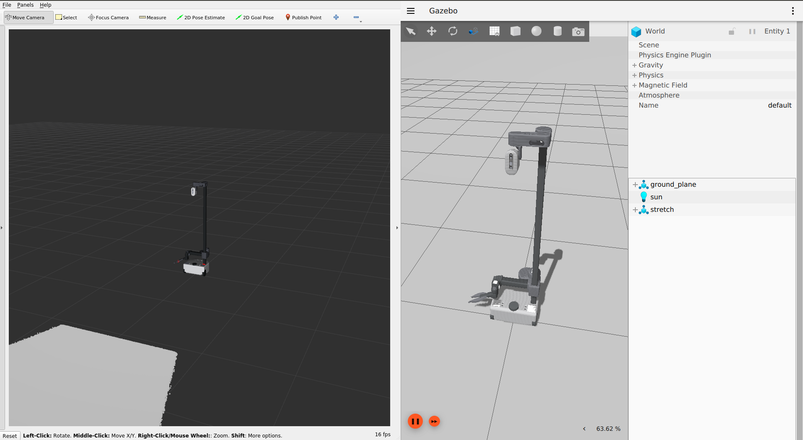
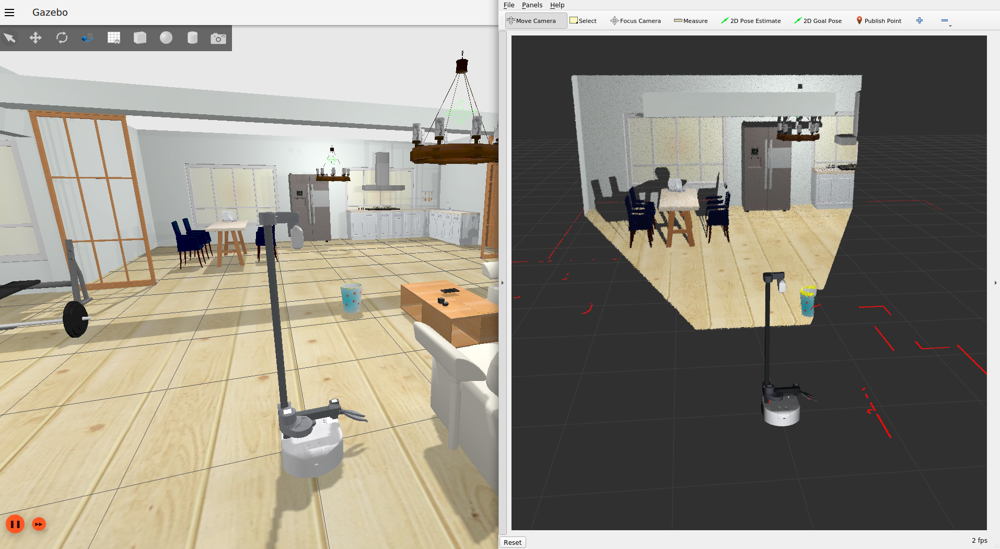

## Overview

*stretch_ignition* is an implementation of simulating a Stretch robot with [Ignition Gazebo](https://ignitionrobotics.org/) simulator.

## Details

The *rviz directory* contains an rviz file that is used for visualizing sensors on rviz with a default configuration.

The *world* directory contains two different [sdf world files](http://sdformat.org/spec?ver=1.6&elem=world). These files loads Ignition physics and enables sensor plugins to work with igtnition

* empty_world.sdf: An empty world instance with LIDAR, IMU and Magnetometer sensor plugins loaded
* aws_small_house.sdf: A playground for Stretch with multiple objects to play with. A modified version of [aws_robomaker_small_house_world](https://github.com/aws-robotics/aws-robomaker-small-house-world), where it is ported to Ignition, and more objects are added. This world file also includes the same sensor plugins with empty_world.

The *launch* directory contains a single launch file *ignition.launch* which spawns the robot with all the sensors ready to use and ignition's internal joint trajectory controllers up and running to control each joint on the robot. The following plugins are loaded as part of this launch file:

* [libignition-gazebo-joint-state-publisher-system.so](https://ignitionrobotics.org/api/gazebo/5.0/classignition_1_1gazebo_1_1systems_1_1JointStatePublisher.html): Publishes joint states
* [libignition-gazebo-diff-drive-system.so](https://ignitionrobotics.org/api/gazebo/5.0/classignition_1_1gazebo_1_1systems_1_1DiffDrive.html): Enables the robot to take *cmd_vel* commands and drives the base
* [libignition-gazebo-joint-trajectory-controller-system.so](https://ignitionrobotics.org/api/gazebo/5.0/classignition_1_1gazebo_1_1systems_1_1JointTrajectoryController.html): Specifies PID controllers for each joint except the wheel joints (which are drive by diff-drive system) and enables robot to subscribe and execute `joint_trajectory` commands.
* Sensors: Various sensor plugins with noises and parameters configured such that they represent the noise values from the sensor's datahseet. Sensors inlcuded here are base and wrist IMU, LIDAR and Realsense D435i. Note that being a depth camera Realsense D435i can affect decrease simulation's realtime capabilities. Consider removing it by setting *realsense* parameter in *stretch_description.xacro* to false if you do not use it. Additionally you can disable the additional IR and color camera topics without depth information by setting *realsense_extra_topics* to false in *stretch_ignition.xacro*

All these plugins can be found in *stretch_ignition_plugins.xacro* that is located under *urdf* directory of *stretch_description* package along with other xacro files.

<!-- Launch file parameters here -->

*ignition.launch.py* contains three different launch parameters that can be set from the command line:

* `use_sim_time`: If true, use simulated clock from the Ignition simulator instead of real time. Defaults to true.
* `rviz`: If true, pop up an rviz instance to ease sensor visualization. Defaults to false.
* `aws`: If true, spawn an aws_robomaker_small_house_world instance with plenty of objects to play around, else spawns an empty world instead. Defaults to false.
<!-- Line by line launch file documentation here -->

<!-- TODO: Stretch Ignition Control Documentation -->

<!-- TODO: Moveit documentation -->

<!-- TODO: Find a way to not set IGN Resource path -->

<!-- TODO: Install instructions -->

## Spawning Stretch in Ignition with Empty World

```bash
    # Terminal 1:
    ros2 launch stretch_ignition ignition.launch.py rviz:=true
    # Terminal 2:
    ros2 run teleop_twist_keyboard teleop_twist_keyboard
```

This will launch an Rviz instance that visualizes the sensors and an empty world in Ignition with Stretch and load all the controllers. Although, the base will be able to move with the keyboard teleop comamnds, the teleop won't give joint trajectory commands to arm, head or gripper. To move these joints see the next section about *Running Ignition with MoveIt2 and Stretch*.



## Spawning Stretch in Ignition with Small House World

```bash
    # Terminal 1:
    ros2 launch stretch_ignition ignition.launch.py rviz:=true aws:=true
    # Terminal 2:
    ros2 run teleop_twist_keyboard teleop_twist_keyboard
```


This will launch an Rviz instance that visualizes the sensors and an empty world in Ignition with Stretch and load all the controllers. Although, the base will be able to move with the joystick comamnds, the joystick won't give joint trajectory to arm, head or gripper. To move these joints see the next section about *Running Ignition with MoveIt2 and Stretch*.

## Running Ignition with MoveIt2 and Stretch

```bash
    # Terminal 1:
    ros2 launch stretch_ignition ignition.launch.py aws:=true
    # Terminal 2:
    ros2 launch stretch_moveit_config demo_ignition.launch.py
```

*Note*: All the tests for this package has been done with the binary release of Ignition Edifice on Ubuntu 20.04, using ROS2 Foxy.
